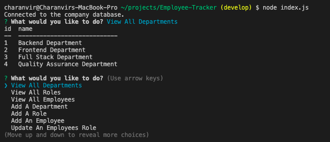

# Employee Tracker

  

## <u>Table of Contents</u>
1. [Description](#description)
2. [Installation](#installation)
3. [Usage](#usage)
4. [Contributing](#contributing)
5. [Questions](#questions)
6. [License](#license)

## Description
***

Employee Tracker is a Node.js application that utilizes Inquirer and MySQL to track a company's employee database. 

When this application is ran, it creates a new database within the user's MySQL and creates tables with seeds values in them. The user is then presented multiple prompts which all have distinct purposes and functions. The user can view all of the departments, roles and employees the database created. They can also add a new department, role or employee. Finally, they can also update a current employees role to better reflect their new responsibilites in the company.

## Installation
***

To install this application get the repository link from above, either via an HTTP or SSH link. 

```
git clone 
```

Once you have the repository cloned to your local machine, navigate to the root of the repository in your terminal.

```
npm install
```

This will install all the necessary dependencies that are needed for the application to run.

Then in the db folder, create a file called "credentials.js" and create the following variables: user and password. Set these variables to a string of your SQL user and SQL password for the application to run. Don't worry, this file is included in the .gitignore ensuring that no one will be able to view your credential information.

Once this file is set up, the application will function and can be ran.


## Usage
***

To use this application, navigate to the root of this repository in the terminal and enter the following command 

```
node index.js
```

This will begin the application and the initial prompt will be presented to the user. 

The following images show the application being used: 

 

***



***


***


***

The following is a link to a video which shows how the application is used: [Employee Tracker Walkthrough Video]()


## Contributing
***

To contribute to this application, push any enhancements and changes you code and send an email to charanvir123@gmail.com. The developer will get back to you if they wish to implement any of the code changes you've made. 

## Questions
***
To view more projects visit my [Github](https://github.com/Charanvir) account.

Direct any additional questions you have regarding this application to charanvir123@gmail.com

## License
***
The following application is covered under the MIT License
